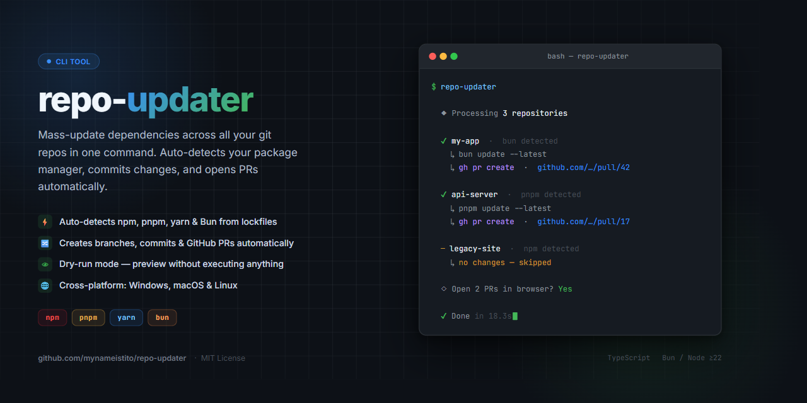

# repo-updater

[](https://www.npmjs.com/package/repo-updater)
[](https://www.npmjs.com/package/repo-updater)
[](https://github.com/mynameistito/repo-updater/actions/workflows/ci.yml)
[](LICENSE)

CLI tool that mass-updates dependencies across multiple git repositories using your preferred package manager ([npm](https://www.npmjs.com/), [pnpm](https://pnpm.io/), [yarn](https://yarnpkg.com/), or [Bun](https://bun.sh)). Automatically detects the package manager, commits changes, creates pull requests via [`gh`](https://cli.github.com), and opens all resulting PR URLs in the browser.

Replaces manually running a dependency update workflow in each repo one-by-one.



## Table of Contents

- [Features](#features)
- [Prerequisites](#prerequisites)
- [Setup](#setup)
- [Usage](#usage)
  - [Options](#options)
  - [Positional arguments](#positional-arguments)
  - [Examples](#examples)
- [Config file](#config-file)
  - [Format](#format)
- [How it works](#how-it-works)
  - [Package Manager Detection](#package-manager-detection)
  - [Update Pipeline](#update-pipeline)
  - [Workspace support](#workspace-support)
  - [Changesets support](#changesets-support)
  - [Dry-run mode](#dry-run-mode)
- [Example Scenarios](#example-scenarios)
- [Contributing](#contributing)

## Features

- **Auto-detection**: Automatically detects which package manager to use based on lockfiles
- **Multi-package manager support**: Works with npm, pnpm, yarn, and Bun
- **Monorepo/workspace support**: Detects workspace configuration (`pnpm-workspace.yaml`, `package.json` workspaces) and updates all workspace packages
- **Batch processing**: Update dependencies in multiple repos in one command
- **GitHub integration**: Creates pull requests and opens them in your browser
- **Changesets support**: Automatically writes a changeset file on repos that use [Changesets](https://github.com/changesets/changesets), so CI is never blocked by a missing changeset
- **Dry-run mode**: Preview changes without executing anything
- **Cross-platform**: Runs on Windows, macOS, and Linux

## Prerequisites

- [Git](https://git-scm.com)
- [GitHub CLI (`gh`)](https://cli.github.com) — authenticated via `gh auth login`
- [Bun](https://bun.sh) ≥ 1.0.0 **or** [Node.js](https://nodejs.org) ≥ 22.0.0

## Setup

**With Bun:**
```sh
bun install repo-updater -g
```

**With npm:**
```sh
npm install repo-updater -g
```

## Usage

```text
repo-updater [options] [repo paths...]
```

### Options

| Flag | Description |
| --- | --- |
| `-h`, `--help` | Show help message |
| `-n`, `--dry-run` | Print every step without executing any commands |
| `-m`, `--minor` | Restrict updates to minor/patch versions (uses base update command without major version bumps) |
| `-c`, `--config <path>` | Path to a custom config file |
| `-b`, `--browser <path>` | Path to browser executable (e.g. `brave.exe`). Auto-saved to config file for future runs |
| `--no-workspaces` | Skip workspace detection and update root only |
| `--no-changeset` | Skip automatic changeset creation |

### Positional arguments

Pass one or more absolute repo paths directly to override the config file:

```sh
repo-updater C:\path\to\repo1 C:\path\to\repo2
```

### Examples

```sh
# Update all repos listed in config
repo-updater

# Preview what would happen without touching anything
repo-updater --dry-run

# Use a different config file
repo-updater -c ./other-config.json

# Update a single repo directly
repo-updater C:\path\to\single-repo

# Update a monorepo but skip workspace packages
repo-updater --no-workspaces C:\path\to\monorepo

# Update without generating changeset files
repo-updater --no-changeset

# Specify a browser (auto-saved to config for future runs)
repo-updater -b "C:\Program Files\BraveSoftware\Brave-Browser\Application\brave.exe"
```

## Config file

The tool searches for a config file in this order:

1. Explicit path via `-c` / `--config`
2. `./repo-updater.config.json` (current working directory)
3. `~/.config/repo-updater/config.json` (user home)

### Format

```json
{
  "repos": [
    "C:\\path\\to\\repo-one",
    "C:\\path\\to\\repo-two",
    "/home/user/project-one",
    "/path/to/repo-three"
  ],
  "browser": "C:\\Program Files\\BraveSoftware\\Brave-Browser\\Application\\brave.exe"
}
```

The `repos` array contains absolute paths to git repositories. Directories that don't exist or aren't git repositories are skipped with a warning.

The optional `browser` field specifies the path to a browser executable. When set, PR URLs are opened in this browser instead of the system default. This is useful on Windows where the OS may silently reset your default browser to Edge. You can also set this with the `-b` / `--browser` CLI flag, which auto-saves it to the config file.

## How it works

### Package Manager Detection

The tool automatically detects which package manager to use by checking for lockfiles in this priority order:

1. `bun.lock` → Bun
2. `pnpm-lock.yaml` → pnpm
3. `yarn.lock` → yarn
4. `package-lock.json` → npm
5. (fallback) → npm

This allows you to manage repos using different package managers in a single batch operation without any configuration.

### Update Pipeline

For each repository, the tool runs this pipeline sequentially:

| Step | Command |
| --- | --- |
| 1 | Detect package manager from lockfiles |
| 2 | Detect default branch via `git symbolic-ref refs/remotes/origin/HEAD` (fallback to `main`) |
| 3 | `git checkout <default-branch>` |
| 4 | `git pull` |
| 5 | `git checkout -b chore/dep-updates-YYYY-MM-DD-<timestamp>` |
| 6 | `npx --yes npm-check-updates --upgrade` / `pnpm update --latest` / `yarn upgrade --latest` / `bun update --latest` |
| 6a | If workspace detected (and `--no-workspaces` not set): replaces step 6 with the workspace-aware update command (e.g. `npx --yes npm-check-updates --upgrade --workspaces`, `pnpm update --latest -r`, `bun update --latest`) |
| 7 | `<pm> install` |
| 8 | If repo uses Changesets and `dependencies` changed (and `--no-changeset` not set): write `.changeset/dep-updates-<timestamp>.md` (multi-package changeset for monorepos) |
| 9 | `git status --porcelain` |
| 10 | `git add -A` |
| 11 | `git commit -m "dep updates YYYY-MM-DD"` |
| 12 | `git push -u origin chore/dep-updates-YYYY-MM-DD-<timestamp>` |
| 13 | `gh pr create --title "Dep Updates YYYY-MM-DD" --body "Dep Updates YYYY-MM-DD"` |

If step 9 shows no changes, the branch is deleted and the repo is skipped (reported as "no changes").

After all repos are processed, a summary box lists every PR URL. You're then prompted to open them all in the browser.

All URLs open in a single browser window. The tool detects your default browser automatically. On Windows, detection can be unreliable — if PRs keep opening in the wrong browser, use `-b` to specify the correct executable path.

**On failure:** if any step fails after a branch has been created, the tool automatically cleans up — it checks out the default branch, deletes the local branch, and (if already pushed) deletes the remote branch too. Repos are never left in a dirty state.

### Workspace support

For monorepo projects, repo-updater automatically detects workspace configuration and updates all workspace packages alongside the root. Detection checks (in order):

1. `pnpm-workspace.yaml` — parses the `packages:` list
2. `package.json` `workspaces` field — supports npm, yarn, and Bun formats (both array and `{ packages: [...] }`)

When a workspace is detected, the tool resolves all workspace package directories, runs the appropriate workspace-aware update command for the detected package manager, and tracks dependency changes across all packages for changeset generation.

Use `--no-workspaces` to skip workspace detection and update only the root `package.json`.

### Changesets support

If the target repo uses [Changesets](https://github.com/changesets/changesets), repo-updater automatically writes a changeset file before committing so CI isn't blocked by a missing changeset.

Detection triggers on **either** condition:

- `.changeset/config.json` exists in the repo root
- `@changesets/cli` is listed in `devDependencies`

When detected, the tool diffs `dependencies` before and after the update. If any changed and the target changeset file doesn't already exist (e.g., from a previous run), it writes `.changeset/dep-updates-<timestamp>.md`:

```markdown
---
"my-lib": patch
---

Updated dependencies:
- react: 18.2.0 → 18.3.1
- zod: 3.21.0 → 3.24.1
```

For monorepos with workspaces, the changeset includes all workspace packages that had dependency changes:

```markdown
---
"@scope/app": patch
"@scope/utils": patch
---

Updated dependencies:
**@scope/app**:
- react: 18.2.0 → 18.3.1

**@scope/utils**:
- lodash: 4.17.20 → 4.17.21
```

Only `dependencies` are considered — changes to `peerDependencies` do not trigger a changeset. `devDependencies` are always excluded as they are never shipped to consumers.

Use `--no-changeset` to skip automatic changeset creation entirely.

### Dry-run mode

With `--dry-run`, each step is printed to the console prefixed with `[dry-run]` but nothing is executed. No git commands run, no branches are created, no PRs are opened.

> **Note:** In dry-run mode the default branch is assumed to be `main` rather than detected dynamically. If your default branch is something other than `main`, the printed commands will still show `main` — the actual branch will be detected and used at real runtime.

## Example Scenarios

### Multiple repos with different package managers

Manage repos using different package managers in a single batch operation:

```json
{
  "repos": [
    "/path/to/npm-project",
    "/path/to/pnpm-monorepo",
    "/path/to/yarn-workspace",
    "/path/to/bun-project"
  ]
}
```

repo-updater will detect each package manager and run the appropriate update commands.

### Single repo directly

```sh
repo-updater C:\path\to\single-repo
```

No config file needed — just pass the path directly.

## Contributing

```sh
# Install dependencies
bun install

# Run tests (Bun)
bun test

# Run tests (Node.js)
bun run test:node

# Lint and type-check
bun run check

# Auto-fix lint issues
bun run fix
```

This project uses [Changesets](https://github.com/changesets/changesets) for versioning. To propose a version bump with your PR, run:

```sh
bunx changeset
```

and commit the generated changeset file alongside your changes.
